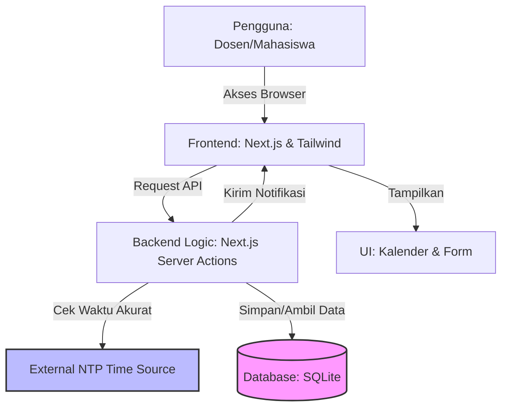
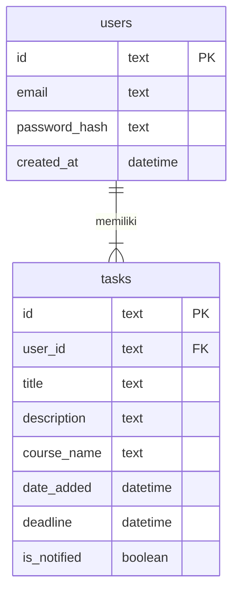

    # PRD — Project Requirements Document

## 1. Overview
Aplikasi ini adalah sistem manajemen tugas berbasis web yang dirancang khusus untuk membantu Dosen dan Mahasiswa dalam melacak tenggat waktu_assignment_ atau tugas kuliah. Masalah utama yang ingin diselesaikan adalah ketidakakuratan waktu pada perangkat pengguna yang dapat menyebabkan kesalahan pencatatan deadline, serta kesulitan visualisasi tugas dalam bentuk daftar biasa.

Tujuan utama aplikasi ini adalah menyediakan platform terpusat yang berjalan secara lokal (localhost) dengan penyimpanan data ringan (SQLite), dilengkapi sinkronisasi waktu presisi (NTP) untuk memastikan semua timestamp tugas akurat, serta tampilan kalender yang intuitif untuk memantau jadwal.

## 2. Requirements
Berikut adalah persyaratan utama yang harus dipenuhi oleh sistem ini:
- **Aksesibilitas:** Aplikasi berbasis web yang dapat diakses melalui browser.
- **Lingkungan:** Harus dapat dijalankan secara lokal (localhost) tanpa ketergantungan cloud eksternal yang rumit.
- **Keamanan:** Wajib memiliki sistem autentikasi (Login/Register) untuk memisahkan data antar pengguna.
- **Akurasi Waktu:** Sistem harus mengambil waktu standar (NTP) untuk pencatatan waktu pembuatan tugas, bukan bergantung pada waktu lokal komputer pengguna.
- **Penyimpanan:** Menggunakan database SQLite untuk kemudahan portabilitas dan pengelolaan data.
- **Notifikasi:** Mendukung notifikasi browser untuk mengingatkan pengguna mendekati deadline.
- **Tampilan:** Utama menggunakan tampilan Kalender untuk melihat distribusi tugas.

## 3. Core Features
Fitur-fitur inti yang akan dikembangkan dalam versi awal ini:
- **Autentikasi Pengguna:** Registrasi dan Login aman untuk Dosen dan Mahasiswa.
- **Manajemen Tugas (CRUD):** Pengguna dapat menambah, melihat, mengedit, dan menghapus tugas.
- **Detail Tugas:** Setiap tugas memiliki Judul, Deskripsi, Mata Kuliah, Tanggal Penambahan (otomatis via NTP), dan Tanggal Deadline.
- **Kalender Interaktif:** Visualisasi tugas dalam bentuk kalender bulanan/mingguan.
- **Sinkronisasi Waktu NTP:** Backend secara otomatis menyinkronkan waktu saat tugas dibuat untuk memastikan konsistensi.
- **Notifikasi Browser:** Peringatan muncul di browser jika ada tugas yang mendekati deadline.

## 4. User Flow
Alur perjalanan pengguna secara sederhana adalah sebagai berikut:
1.  **Akses Aplikasi:** Pengguna membuka aplikasi di browser (localhost).
2.  **Autentikasi:** Pengguna mendaftar atau login menggunakan email dan password.
3.  **Dashboard Kalender:** Setelah login, pengguna langsung diarahkan ke tampilan Kalender yang berisi tugas-tugas mereka.
4.  **Tambah Tugas:** Pengguna klik tombol "Tambah Tugas", mengisi form (Judul, Kuliah, Deadline, Deskripsi).
5.  **Proses Sistem:** Sistem mencatat waktu saat ini melalui referensi NTP dan menyimpan data ke SQLite.
6.  **Notifikasi:** Sistem mengecek deadline secara berkala dan mengirimkan notifikasi browser jika diperlukan.
7.  **Selesai:** Pengguna melihat tugas baru muncul di kalender.

## 5. Architecture
Sistem ini menggunakan arsitektur web modern di mana browser berinteraksi dengan aplikasi Next.js, yang kemudian mengelola logika bisnis, sinkronisasi waktu, dan penyimpanan database.

## 6. Database Schema
Database menggunakan SQLite dengan dua tabel utama: `users` untuk menyimpan data akun, dan `tasks` untuk menyimpan data tugas. Setiap tugas terhubung ke satu pengguna.

**Detail Tabel:**
- **users:** Menyimpan informasi akun. `password_hash` untuk keamanan password.
- **tasks:** Menyimpan informasi tugas.
    - `date_added`: Diisi otomatis oleh sistem menggunakan waktu NTP saat tugas dibuat.
    - `deadline`: Diisi oleh pengguna sesuai tenggat waktu tugas.
    - `user_id`: Kunci asing untuk menghubungkan tugas ke pemiliknya.

## 7. Tech Stack
Berdasarkan kebutuhan akan performa, kemudahan pengembangan, dan kompatibilitas SQLite, berikut adalah rekomendasi teknologi yang akan digunakan:

- **Frontend & Backend:** **Next.js** (JavaScript/React). Memungkinkan pengembangan full-stack dalam satu proyek dengan performa tinggi.
- **Styling:** **Tailwind CSS** & **shadcn/ui**. Untuk membangun tampilan yang bersih, responsif, dan komponen UI siap pakai (termasuk Kalender dan Form).
- **Database:** **SQLite**. Database ringan berbasis file, cocok untuk deployment localhost dan tidak memerlukan instalasi server database terpisah.
- **ORM:** **Drizzle ORM**. Alat untuk berinteraksi dengan database SQLite menggunakan kode JavaScript yang aman dan mudah.
- **Autentikasi:** **Better Auth**. Solusi autentikasi yang aman dan mudah diintegrasikan dengan Next.js untuk manajemen user.
- **Deployment:** **Localhost**. Aplikasi dijalankan secara lokal di mesin pengguna untuk keperluan pribadi atau jaringan lokal terbatas.